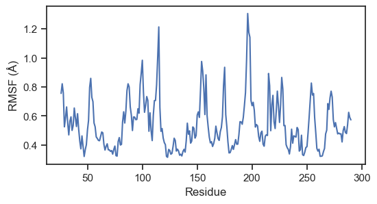

# Guide for evaluating metrics for a Molecular dynamics (MD) simulation with AMBER Software on ASU Sol cluster

## Follow the MDGuide to run the MD simulation first

Follow the MDGuide guide here: [MDGuide](https://github.com/John-Kazan/MDGuide)

## Using VPN to connect to ASU network:

Follow the VPN guide here: [VPNGuide](https://github.com/John-Kazan/VPNGuide)

## After logging in to SoL cluster:

`pwd` shows me home directory `/home/ikazan`

change directory to scratch space

```
cd /scratch/ikazan
```

create a new directory here by using

```
mkdir -pv evaluationdir1
```

change directory to the new one

```
cd evaluationdir1/
```

```
ls
```

the directory is empty

`pwd` shows me the current working directory

copy the sol path: `/scratch/ikazan/evaluationdir1`

## Two options to download required files (I recommend option 2)

### Option 1

open a new ternminal tab (this will be connected to your own computer)

download the parameter file under `mdtrajectory` on github

and download the trajectory from the dropbox link:

[1btl.nc](https://www.dropbox.com/scl/fi/rcn2cecemv2erab298t4k/1btl.nc?rlkey=eqppb7rtuvxvmzghdp0ks4zsd&dl=0)

go to the directory where you have the files and copy the them to sol

```
scp ./*.parm7 ikazan@login.sol.rc.asu.edu:/scratch/ikazan/evaluationdir1/
```

```
scp ./*.nc ikazan@login.sol.rc.asu.edu:/scratch/ikazan/evaluationdir1/
```

we are going to switch the termnial window to the sol session one

### Option 2

copy the parameter and trajectory file directly on sol

```
cp -rv /scratch/ikazan/shared/test ./
```


## Start an interactive session

we are going to start an interactive session by running

```
interactive
```

## Reading the trajectory and evaluation

load the necessary modules on sol by running:

```
module load amber/22v3
```

then we are going to start the evaluation process by running:

```
cpptraj
```

this will start the `cpptraj` software

first we need to load the parameter (topology) file

```
parm 1btl.parm7
```

then we are going to load the trajectory

```
trajin 1btl.nc
```

After succesfully loading the parameter and trajectory files we need to do some cleaning first by removing water molecules and the ions

```
strip :WAT,Cl-,Na+
```

then superimpose (align) the trajectory

```
autoimage origin
```

```
rms first mass @CA,C,N
```

Then we will evaluate the Root Mean Square Fluctuation (RMSF)

RMSF is a measurement of flexibility. It measures how much amino acid residues of a protein move around over time during a molecular dynamics simulation. We will use the alpha carbon (CA) locations of amino acids to calculate the RMSF.

```
atomicfluct out rmsf.txt @CA
```

at this point all the commands should be entered. To run the commands simply type:

```
run
```

After processing is complete, type `quit` to exit the application.

copy `rmsf.txt` back to your computer by running the following command on the terminal connected to your local computer

```
scp ikazan@login.sol.rc.asu.edu:/scratch/ikazan/evaluationdir1/rmsf.txt ./
```

Compare the `rmsf.txt` file you generated to the one provide under `outputs` folder on github

Now use your favorite tool to generate a plot

<p align="center" width="100%">
    
</p>

The python (python 3) code used to generate the plot is below:

```
import pandas as pd
import seaborn as sns
import matplotlib.pyplot as plt

df = pd.read_csv('rmsf.txt', delim_whitespace=True, header=0)
df['Residue'] = [26, 27, 28, 29, 30, 31, 32, 33, 34, 35, 36, 37, 38, 39, 40, 41, 42, 43, 44, 45, 46, 47, 48, 49, 50, 51, 52, 53, 54, 55, 56, 57, 58, 59, 60, 61, 62, 63, 64, 65, 66, 67, 68, 69, 70, 71, 72, 73, 74, 75, 76, 77, 78, 79, 80, 81, 82, 83, 84, 85, 86, 87, 88, 89, 90, 91, 92, 93, 94, 95, 96, 97, 98, 99, 100, 101, 102, 103, 104, 105, 106, 107, 108, 109, 110, 111, 112, 113, 114, 115, 116, 117, 118, 119, 120, 121, 122, 123, 124, 125, 126, 127, 128, 129, 130, 131, 132, 133, 134, 135, 136, 137, 138, 139, 140, 141, 142, 143, 144, 145, 146, 147, 148, 149, 150, 151, 152, 153, 154, 155, 156, 157, 158, 159, 160, 161, 162, 163, 164, 165, 166, 167, 168, 169, 170, 171, 172, 173, 174, 175, 176, 177, 178, 179, 180, 181, 182, 183, 184, 185, 186, 187, 188, 189, 190, 191, 192, 193, 194, 195, 196, 197, 198, 199, 200, 201, 202, 203, 204, 205, 206, 207, 208, 209, 210, 211, 212, 213, 214, 215, 216, 217, 218, 219, 220, 221, 222, 223, 224, 225, 226, 227, 228, 229, 230, 231, 232, 233, 234, 235, 236, 237, 238, 240, 241, 242, 243, 244, 245, 246, 247, 248, 249, 250, 251, 252, 254, 255, 256, 257, 258, 259, 260, 261, 262, 263, 264, 265, 266, 267, 268, 269, 270, 271, 272, 273, 274, 275, 276, 277, 278, 279, 280, 281, 282, 283, 284, 285, 286, 287, 288, 289, 290]

sns.set(style='ticks')
plt.figure(figsize=(6, 3))
sns.lineplot(x='Residue', y='AtomicFlx', data=df)
plt.xlabel('Residue')
plt.ylabel('RMSF (Å)')
plt.show()
```
